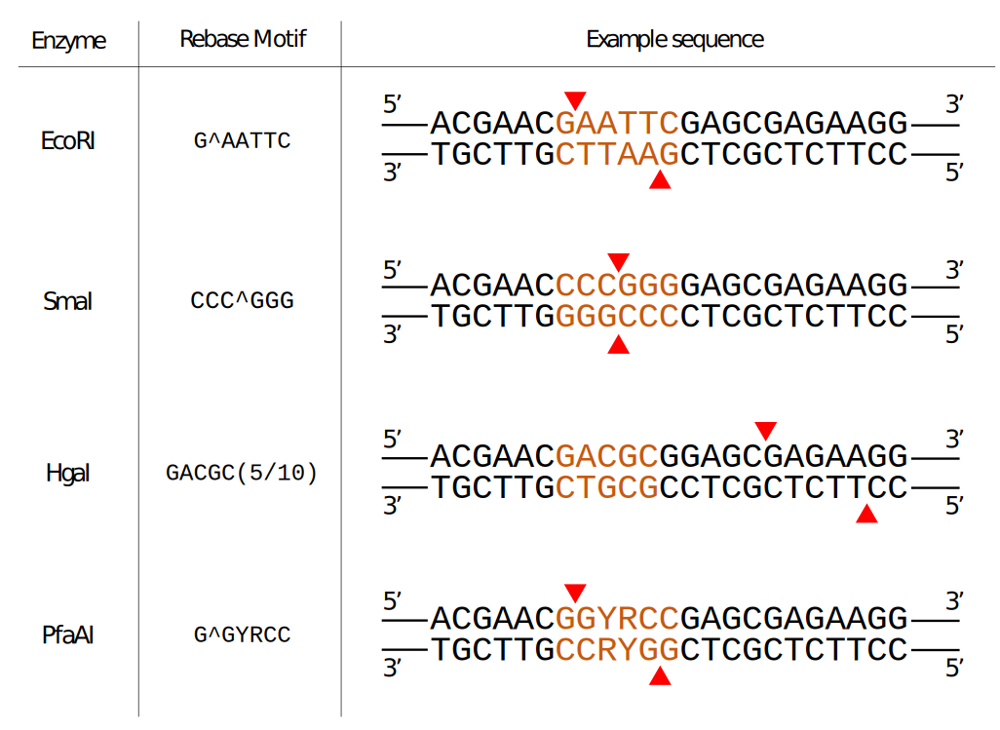
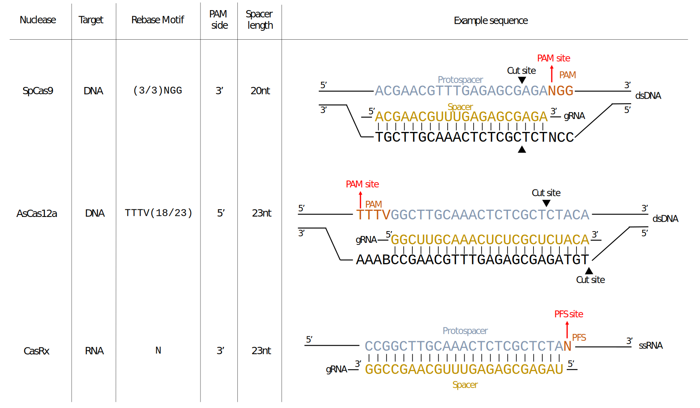
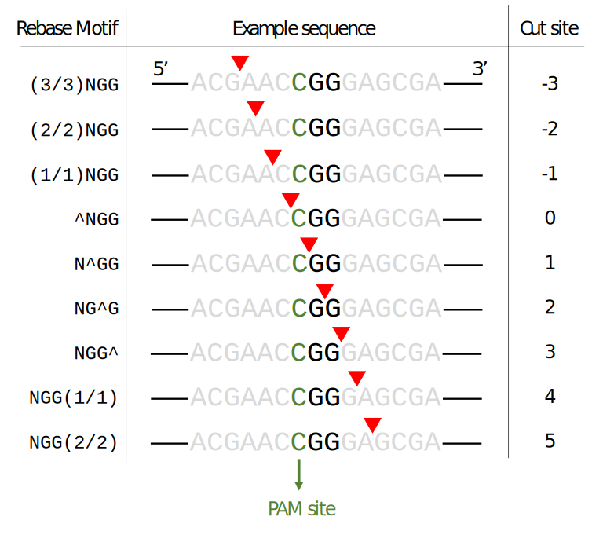
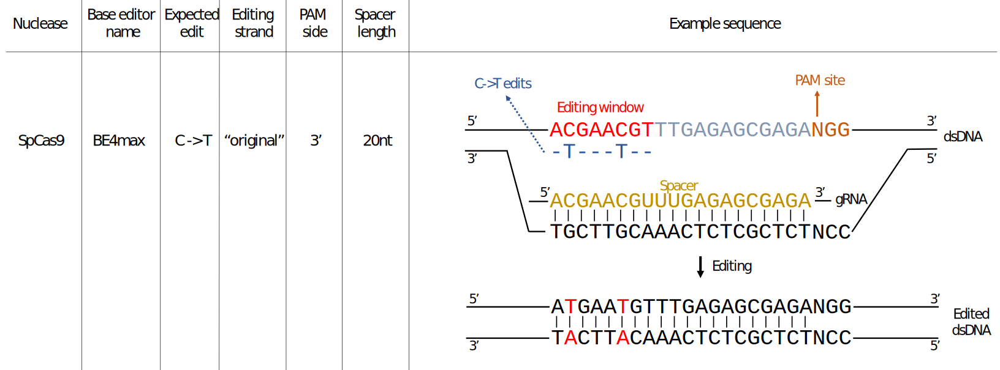
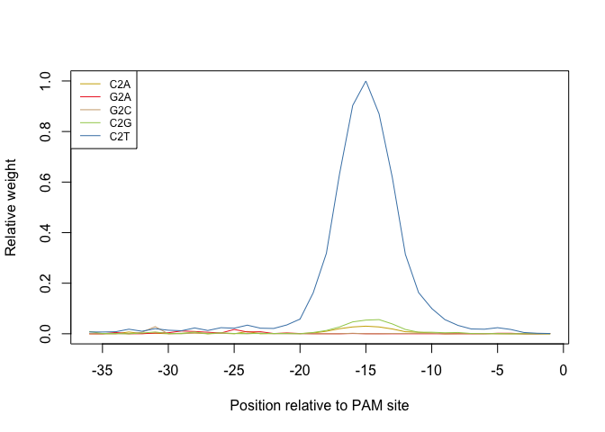
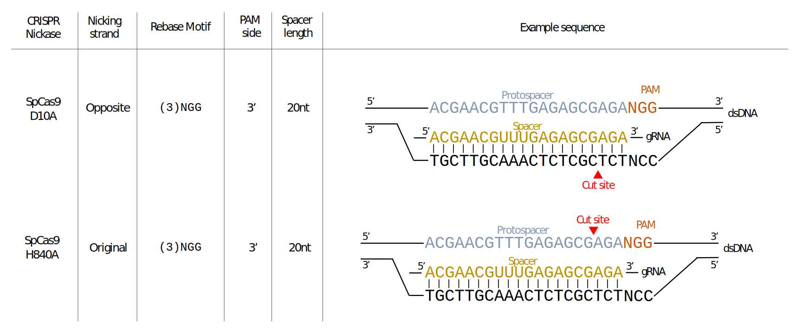

Building custom CRISPR nuclease objects
================

-   [Introduction](#introduction)
-   [Installation](#installation)
    -   [Software requirements](#software-requirements)
        -   [OS Requirements](#os-requirements)
    -   [Installation](#installation-1)
        -   [Getting started](#getting-started)
-   [Nuclease class](#nuclease-class)
    -   [Examples](#examples)
    -   [Accessor functions](#accessor-functions)
-   [CrisprNuclease class](#crisprnuclease-class)
    -   [Examples](#examples-1)
    -   [CrisprNuclease objects provided in
        CrisprBase](#crisprnuclease-objects-provided-in-crisprbase)
-   [CRISPR arithmetics](#crispr-arithmetics)
    -   [CRISPR terminology](#crispr-terminology)
    -   [Cut site](#cut-site)
    -   [Obtaining spacer and PAM sequences from target
        sequences](#obtaining-spacer-and-pam-sequences-from-target-sequences)
    -   [Obtaining genomic coordinates of protospacer sequences using
        PAM site
        coordinates](#obtaining-genomic-coordinates-of-protospacer-sequences-using-pam-site-coordinates)
-   [BaseEditor class](#baseeditor-class)
-   [CrisprNickase class](#crisprnickase-class)
-   [RNA-targeting nucleases](#rna-targeting-nucleases)
-   [Additional notes](#additional-notes)
    -   [dCas9 and other “dead”
        nucleases](#dcas9-and-other-dead-nucleases)
-   [Reproducibility](#reproducibility)
-   [References](#references)

Authors: Jean-Philippe Fortin, Luke Hoberecht

Date: 29 July, 2022

# Introduction

The `crisprBase` package provides S4 classes to represent nucleases, and
more specifically nucleases for CRISPR applications. It also provides
arithmetic functions to extract genomic ranges to help with the design
and manipulation of CRISPR guide-RNAs (gRNAs). The classes and functions
are designed to work with a broad spectrum of nucleases and
applications, including PAM-free CRISPR nucleases, RNA-targeting
nucleases, and the more general class of restriction enzymes. It also
includes functionalities for CRISPR nickases.

It provides a language and convention for our gRNA design ecosystem
described in our recent bioRxiv preprint: [“A comprehensive Bioconductor
ecosystem for the design of CRISPR guide RNAs across nucleases and
technologies”](https://www.biorxiv.org/content/10.1101/2022.04.21.488824v2)

In this tutorial we show how to construct objects of the following S4
classes: `Nuclease`, `CrisprNuclease`, `BaseEditor`, `CrisprNickase`. We
also discuss some important details of these objects, how to easily
retrieve key information with accessor functions, and how to use
arithmetic functions on these objects in facilitating gRNA design.

# Installation

## Software requirements

### OS Requirements

This package is supported for macOS, Linux and Windows machines. It was
developed and tested on R version 4.2.

## Installation

`crisprBase` can be installed by entering the following commands in an R
session:

``` r
install.packages("devtools")
library(devtools)
install_github("Jfortin1/crisprBase")
```

### Getting started

`crisprBase` can be loaded in the usual way:

``` r
library(crisprBase)
```

# Nuclease class

The `Nuclease` class is designed to store minimal information about the
recognition sites of general nucleases, such as restriction enzymes. The
`Nuclease` class has 5 fields:

-   `nucleaseName`: a string giving the name of the nuclease
-   `targetType`: a string specifying whether the nuclease targets
    `"DNA"` (deoxyribonucleases) or `"RNA"` (ribonucleases)
-   `metadata`: a list of arbitrary length that stores additional
    information about the nuclease
-   `motifs`: a character vector that describes the sequence motifs that
    are recognized by the nuclease for cleavage (always given in the 5’
    to 3’ direction)
-   `weights`: an optional numeric vector that gives the relative
    cleavage probabilities corresponding to the motifs in `motifs`

Note that we use DNA to represent motifs irrespective of the target type
for the sake of simplicity.

We use the Rebase convention in representing motif sequences (Roberts et
al. 2010). For enzymes that cleave within the recognition site, we add
the symbol `^` within the recognition sequence to specify the cleavage
site, always in the 5’ to 3’ direction. For enzymes that cleave away
from the recognition site, we specify the distance of the cleavage site
using a `(x/y)` notation where `x` represents the number of nucleotides
away from the recognition sequence on the original strand, and `y`
represents the number of nucleotides away from the recognition sequence
on the reverse strand.

## Examples

The following examples use the `Nuclease` class constructor function
from `crisprBase` to create `Nuclease` objects representing common
restriction enzymes.

The EcoRI enzyme recognizes the palindromic motif `GAATTC`, and cuts
after the first nucleotide. We can create this nuclease with the
following function:

``` r
EcoRI <- Nuclease("EcoRI",
                  targetType="DNA",
                  motifs=c("G^AATTC"),
                  metadata=list(description="EcoRI restriction enzyme"))
EcoRI
```

    ## Class: Nuclease
    ##   Name: EcoRI
    ##   Target type: DNA
    ##   Metadata: list of length 1
    ##   Motifs: GAATTC
    ##   Weights: 1

The HgaI enzyme recognizes the motif `GACGC`, and cleaves the DNA at 5
nucleotides downstream of the recognition sequence on the original
strand, and at 10 nucleotides downstream of the recognition sequence on
the reverse strand:

``` r
HgaI <- Nuclease("HgaI",
                 targetType="DNA",
                 motifs=c("GACGC(5/10)"),
                 metadata=list(description="HgaI restriction enzyme"))
HgaI
```

    ## Class: Nuclease
    ##   Name: HgaI
    ##   Target type: DNA
    ##   Metadata: list of length 1
    ##   Motifs: GACGC
    ##   Weights: 1

If the cleavage site was upstream of the recognition sequence, we would
instead specify `(5/10)GACGC`.

Any nucleotide letter that is part of the extended IUPAC nucleic acid
code can be used to represent recognition motifs. For instance, we use
`Y` and `R` (pyrimidine and purine, respectively) to specify the
possible recognition sequences for PfaAI:

``` r
PfaAI <- Nuclease("PfaAI",
                  targetType="DNA",
                  motifs=c("G^GYRCC"),
                  metadata=list(description="PfaAI restriction enzyme"))
PfaAI
```

    ## Class: Nuclease
    ##   Name: PfaAI
    ##   Target type: DNA
    ##   Metadata: list of length 1
    ##   Motifs: GGYRCC
    ##   Weights: 1

## Accessor functions

The accessor function `motifs` retrieve the motif sequences:

``` r
motifs(PfaAI)
```

    ## DNAStringSet object of length 1:
    ##     width seq
    ## [1]     6 GGYRCC

To expand the motif sequence into all possible combinations of valid
sequences with only those nucleotides in the set {A, C, G, T}, pass the
argument `expand=TRUE`.

``` r
motifs(PfaAI, expand=TRUE)
```

    ## DNAStringSet object of length 4:
    ##     width seq                                               names               
    ## [1]     6 GGCACC                                            GGYRCC
    ## [2]     6 GGTACC                                            GGYRCC
    ## [3]     6 GGCGCC                                            GGYRCC
    ## [4]     6 GGTGCC                                            GGYRCC



# CrisprNuclease class

CRISPR nucleases are examples of RNA-guided nucleases. They require two
binding components for cleavage. For DNA-targeting CRISPR nucleases, the
nuclease must first recognize a constant nucleotide motif in the target
DNA called the protospacer adjacent motif (PAM) sequence. Second, the
guide-RNA (gRNA), which guides the nuclease to the target sequence,
needs to bind to a complementary sequence adjacent to the PAM sequence
(protospacer sequence). The latter can be thought of a variable binding
motif that can be specified by designing corresponding gRNA sequences.
For CRISPR nucleases targeting RNA, the equivalent of the PAM sequence
is called the Protospacer Flanking Sequence (PFS). We use the terms PAM
and PFS interchangeably as it should be clear from context.

The `CrisprNuclease` class allows for characterization of both binding
components by extending the `Nuclease` class to contain information
about gRNA sequences. The PAM sequence characteristics, and the cleavage
distance with respect to the PAM sequence, are specified using the motif
nomenclature described in the Nuclease section above.

Three additional fields are required:

-   `pam_side`: either `"5prime"` or `"3prime"`, which specifies on
    which side the PAM sequence is located with repsect to the
    protospacer sequence (while it would be more appropriate to use the
    term `pfs_side` for RNA-targeting nucleases, we still use `pam_side`
    for simplicity)
-   `spacer_length`: a numeric value that specifies the default spacer
    length in nucleotides
-   `spacer_gap`: a numeric value that gives the distance in nucleotides
    between the PAM (or PFS) sequence and spacer sequence (for most
    nucleases, `spacer_gap=0` as the spacer sequence is immediately
    adjacent to the PAM/PFS sequence)

## Examples

These examples use the `CrisprNuclease` class constructor function from
`crisprBase` to create `CrisprNuclease` objects that represent some of
the more common CRISPR nucleases.

Here we construct a `CrisprNuclease` object for the Cas9 nuclease
(Streptococcus pyogenes Cas9):

``` r
SpCas9 <- CrisprNuclease("SpCas9",
                         targetType="DNA",
                         pams=c("(3/3)NGG", "(3/3)NAG", "(3/3)NGA"),
                         weights=c(1, 0.2593, 0.0694),
                         metadata=list(description="Wildtype Streptococcus pyogenes Cas9 (SpCas9) nuclease"),
                         pam_side="3prime",
                         spacer_length=20)
SpCas9
```

    ## Class: CrisprNuclease
    ##   Name: SpCas9
    ##   Target type: DNA
    ##   Metadata: list of length 1
    ##   PAMs: NGG, NAG, NGA
    ##   Weights: 1, 0.2593, 0.0694
    ##   Spacer length: 20
    ##   PAM side: 3prime
    ##     Distance from PAM: 0
    ##   Prototype protospacers: 5'--SSSSSSSSSSSSSSSSSSSS[NGG]--3', 5'--SSSSSSSSSSSSSSSSSSSS[NAG]--3', 5'--SSSSSSSSSSSSSSSSSSSS[NGA]--3'

As with the `Nuclease` class, we can specify PAM sequences using the
extended nucleotide code. SaCas9 serves as a good example:

``` r
SaCas9 <- CrisprNuclease("SaCas9",
                         targetType="DNA",
                         pams=c("(3/3)NNGRRT"),
                         metadata=list(description="Wildtype Staphylococcus 
                         aureus Cas9 (SaCas9) nuclease"),
                         pam_side="3prime",
                         spacer_length=21)
SaCas9
```

    ## Class: CrisprNuclease
    ##   Name: SaCas9
    ##   Target type: DNA
    ##   Metadata: list of length 1
    ##   PAMs: NNGRRT
    ##   Weights: 1
    ##   Spacer length: 21
    ##   PAM side: 3prime
    ##     Distance from PAM: 0
    ##   Prototype protospacers: 5'--SSSSSSSSSSSSSSSSSSSSS[NNGRRT]--3'

Here is another example where we construct a `CrisprNuclease` object for
the Cas12a nuclease (AsCas12a):

``` r
AsCas12a <- CrisprNuclease("AsCas12a",
                           targetType="DNA",
                           pams="TTTV(18/23)",
                           metadata=list(description="Wildtype Acidaminococcus
                           Cas12a (AsCas12a) nuclease."),
                           pam_side="5prime",
                           spacer_length=23)
AsCas12a
```

    ## Class: CrisprNuclease
    ##   Name: AsCas12a
    ##   Target type: DNA
    ##   Metadata: list of length 1
    ##   PAMs: TTTV
    ##   Weights: 1
    ##   Spacer length: 23
    ##   PAM side: 5prime
    ##     Distance from PAM: 0
    ##   Prototype protospacers: 5'--[TTTV]SSSSSSSSSSSSSSSSSSSSSSS--3'

## CrisprNuclease objects provided in CrisprBase

Several already-constructed `crisprNuclease` objects for some of the
most popular CRISPR nucleases are available in `crisprBase` for your
convenience. See `data(package="crisprBase")`.

# CRISPR arithmetics

## CRISPR terminology

The terms **spacer** and **protospacer** are not interchangeable.
**spacer** refers to the sequence used in the gRNA construct to guide
the Cas nuclease to the target **protospacer** sequence in the host
genome or transcriptome. The **protospacer** sequence is adjacent to the
PAM sequence or PFS sequence. We use the terminology **target** sequence
to refer to the protospacer and PAM sequence taken together. For
DNA-targeting nucleases such as Cas9 and Cas12a, the sequences that make
up the spacer and protospacer identical, while for RNA-targeting
nucleases such as Cas13d, the spacer and protospacer sequences are
reverse complements.

A given gRNA spacer sequence may not uniquely target the host genome–it
can map to multiple protospacers in the genome. However, for a given
reference genome we can uniquely identify protospacer sequences using a
combination of 3 attributes:

-   **chr**: chromosome name
-   **strand**: forward (+) or reverse (-)
-   **pam_site**: genomic coordinate of the first nucleotide of the
    nuclease-specific PAM sequence. For SpCas9, this corresponds to the
    genomic coordinate of N in the NGG PAM sequence. For AsCas12a, this
    corresponds to the genomic coordinate of the first T nucleotide in
    the TTTV PAM sequence. For RNA-targeting nucleases, this corresponds
    to the first nucleotide of the PFS (we do not use `pfs_site` for
    simplicity).



## Cut site

By convention, we used the nucleotide directly downstream of the DNA cut
to represent the cut site nucleotide position. For instance, for SpCas9
(blunt-ended dsDNA break), the cut site occurs at position `-3` with
respect to the PAM site. For AsCas12a, the 5nt overhang dsDNA break
occurs at 18 nucleotides after the PAM sequence on the targeted strand.
With a PAM sequence of 4 nucleotides (TTTV), the cut site on the forward
strand occurs at position `22` with respect to the PAM site, and at
position `27` on the reverse strand.

The convenience function `cutSites` extracts the cut site coordinates
relative to the PAM site:

``` r
data(SpCas9, package="crisprBase")
data(AsCas12a, package="crisprBase")
cutSites(SpCas9)
```

    ## [1] -3

``` r
cutSites(SpCas9, strand="-")
```

    ## [1] -3

``` r
cutSites(AsCas12a)
```

    ## [1] 22

``` r
cutSites(AsCas12a, strand="-")
```

    ## [1] 27

Below is an illustration of how different motif sequences and cut
patterns translate into cut site coordinates with respect to a PAM
sequence NGG:



## Obtaining spacer and PAM sequences from target sequences

Given a list of target sequences (protospacer + PAM) and a
`CrisprNuclease` object, one can extract the protospacer and PAM
sequences with the functions `extractProtospacerFromTarget` and
`extractPamFromTarget`, respectively.

``` r
targets <- c("AGGTGCTGATTGTAGTGCTGCGG",
             "AGGTGCTGATTGTAGTGCTGAGG")
extractPamFromTarget(targets, SpCas9)
```

    ## [1] "CGG" "AGG"

``` r
extractProtospacerFromTarget(targets, SpCas9)
```

    ## [1] "AGGTGCTGATTGTAGTGCTG" "AGGTGCTGATTGTAGTGCTG"

## Obtaining genomic coordinates of protospacer sequences using PAM site coordinates

Given a PAM coordinate, there are several functions in `crisprBase` that
allows us to obtain the coordinates of the full PAM sequence,
protospacer sequence, and target sequence: `getPamRanges`,
`getTargetRanges`, and `getProtospacerRanges`, respectively. The output
objects are `GRanges`:

``` r
chr      <- rep("chr7",2)
pam_site <- rep(200,2)
strand   <- c("+", "-")
gr_pam <- getPamRanges(seqnames=chr,
                       pam_site=pam_site,
                       strand=strand,
                       nuclease=SpCas9)
gr_protospacer <- getProtospacerRanges(seqnames=chr,
                                       pam_site=pam_site,
                                       strand=strand,
                                       nuclease=SpCas9)
gr_target <- getTargetRanges(seqnames=chr,
                             pam_site=pam_site,
                             strand=strand,
                             nuclease=SpCas9)
gr_pam
```

    ## GRanges object with 2 ranges and 0 metadata columns:
    ##       seqnames    ranges strand
    ##          <Rle> <IRanges>  <Rle>
    ##   [1]     chr7   200-202      +
    ##   [2]     chr7   198-200      -
    ##   -------
    ##   seqinfo: 1 sequence from an unspecified genome; no seqlengths

``` r
gr_protospacer
```

    ## GRanges object with 2 ranges and 0 metadata columns:
    ##       seqnames    ranges strand
    ##          <Rle> <IRanges>  <Rle>
    ##   [1]     chr7   180-199      +
    ##   [2]     chr7   201-220      -
    ##   -------
    ##   seqinfo: 1 sequence from an unspecified genome; no seqlengths

``` r
gr_target
```

    ## GRanges object with 2 ranges and 0 metadata columns:
    ##       seqnames    ranges strand
    ##          <Rle> <IRanges>  <Rle>
    ##   [1]     chr7   180-202      +
    ##   [2]     chr7   198-220      -
    ##   -------
    ##   seqinfo: 1 sequence from an unspecified genome; no seqlengths

and for AsCas12a:

``` r
gr_pam <- getPamRanges(seqnames=chr,
                       pam_site=pam_site,
                       strand=strand,
                       nuclease=AsCas12a)
gr_protospacer <- getProtospacerRanges(seqnames=chr,
                                       pam_site=pam_site,
                                       strand=strand,
                                       nuclease=AsCas12a)
gr_target <- getTargetRanges(seqnames=chr,
                             pam_site=pam_site,
                             strand=strand,
                             nuclease=AsCas12a)
gr_pam
```

    ## GRanges object with 2 ranges and 0 metadata columns:
    ##       seqnames    ranges strand
    ##          <Rle> <IRanges>  <Rle>
    ##   [1]     chr7   200-203      +
    ##   [2]     chr7   197-200      -
    ##   -------
    ##   seqinfo: 1 sequence from an unspecified genome; no seqlengths

``` r
gr_protospacer
```

    ## GRanges object with 2 ranges and 0 metadata columns:
    ##       seqnames    ranges strand
    ##          <Rle> <IRanges>  <Rle>
    ##   [1]     chr7   204-226      +
    ##   [2]     chr7   174-196      -
    ##   -------
    ##   seqinfo: 1 sequence from an unspecified genome; no seqlengths

``` r
gr_target
```

    ## GRanges object with 2 ranges and 0 metadata columns:
    ##       seqnames    ranges strand
    ##          <Rle> <IRanges>  <Rle>
    ##   [1]     chr7   200-226      +
    ##   [2]     chr7   174-200      -
    ##   -------
    ##   seqinfo: 1 sequence from an unspecified genome; no seqlengths

# BaseEditor class

Base editors are inactive Cas nucleases coupled with a specific
deaminase. For instance, the first cytosine base editor (CBE) was
obtained by coupling a cytidine deaminase with dCas9 to convert Cs to Ts
(Komor et al. 2016).



We provide in `crisprBase` an S4 class, `BaseEditor`, to represent base
editors. It extends the `CrisprNuclase` class with 3 additional fields:

-   `baseEditorName`: string specifying the name of the base editor.
-   `editingStrand`: strand where the editing happens with respect to
    the target protospacer sequence (“original” or “opposite”).
-   `editingWeights`: a matrix of experimentally-derived editing
    weights.

We show below how to build a `BaseEditor` object with the CBE base
editor BE4max with weights obtained from Arbab et al. (2020).

We first obtain a matrix of weights for the BE4max editor stored in the
package `crisprBase`:

``` r
# Creating weight matrix
weightsFile <- system.file("be/b4max.csv",
                           package="crisprBase",
                           mustWork=TRUE)
ws <- t(read.csv(weightsFile))
ws <- as.data.frame(ws)
```

The row names of the matrix must correspond to the nucleotide
substitutions. Nucleotide substitutions that are not present in the
matrix will have weight assigned to `0`.

``` r
rownames(ws)
```

    ## [1] "Position" "C2A"      "C2G"      "C2T"      "G2A"      "G2C"

The column names must correspond to the relative position with respect
to the PAM site.

``` r
colnames(ws) <- ws["Position",]
ws <- ws[-c(match("Position", rownames(ws))),,drop=FALSE]
ws <- as.matrix(ws)
head(ws)
```

    ##     -36 -35 -34 -33 -32 -31 -30 -29 -28 -27 -26 -25 -24 -23 -22 -21 -20  -19
    ## C2A 0.0 0.0 0.0 0.7 0.1 0.2 0.0 0.2 0.3 0.0 0.2 0.0 0.9 0.0 0.1 0.2 0.1  0.3
    ## C2G 0.9 0.1 0.1 0.0 0.3 0.7 0.1 0.1 0.7 0.0 0.4 0.1 0.1 0.1 0.1 0.1 0.0  0.5
    ## C2T 0.7 0.7 0.8 1.8 1.0 2.0 1.4 1.2 2.3 1.3 2.4 2.2 3.4 2.2 2.1 3.5 5.8 16.2
    ## G2A 0.0 0.0 0.5 0.0 0.0 0.3 0.4 1.1 0.9 0.6 0.3 1.7 0.7 0.8 0.1 0.3 0.1  0.0
    ## G2C 0.1 0.0 0.0 0.0 0.6 2.8 0.0 0.0 0.3 0.2 0.2 0.1 0.0 0.3 0.0 0.0 0.0  0.0
    ##      -18  -17  -16    -15  -14  -13  -12  -11  -10  -9  -8  -7  -6  -5  -4  -3
    ## C2A  1.0  2.0  2.7   3.00  2.7  1.9  0.8  0.6  0.3 0.0 0.1 0.1 0.1 0.0 0.0 0.0
    ## C2G  1.3  2.7  4.7   5.40  5.6  3.9  1.7  0.6  0.6 0.4 0.5 0.1 0.0 0.1 0.0 0.0
    ## C2T 31.8 63.2 90.3 100.00 87.0 62.0 31.4 16.3 10.0 5.6 3.3 1.9 1.8 2.4 1.7 0.5
    ## G2A  0.0  0.0  0.1   0.01  0.0  0.0  0.0  0.0  0.0 0.0 0.0 0.0 0.0 0.2 0.2 0.0
    ## G2C  0.0  0.0  0.2   0.00  0.0  0.1  0.1  0.2  0.2 0.0 0.0 0.0 0.1 0.0 0.0 0.0
    ##      -2  -1
    ## C2A 0.0 0.0
    ## C2G 0.0 0.0
    ## C2T 0.2 0.1
    ## G2A 0.0 0.1
    ## G2C 0.0 0.0

Since BE4max uses Cas9, we can use the SpCas9 `CrisprNuclease` object
available in `crisprBase` to build the `BaseEditor` object:

``` r
data(SpCas9, package="crisprBase")
BE4max <- BaseEditor(SpCas9,
                     baseEditorName="BE4max",
                     editingStrand="original",
                     editingWeights=ws)
metadata(BE4max)$description_base_editor <- "BE4max cytosine base editor."
BE4max
```

    ## Class: BaseEditor
    ##   CRISPR Nuclease name: SpCas9
    ##       Target type: DNA
    ##       Metadata: list of length 2
    ##       PAMs: NGG, NAG, NGA
    ##       Weights: 1, 0.2593, 0.0694
    ##       Spacer length: 20
    ##       PAM side: 3prime
    ##         Distance from PAM: 0
    ##       Prototype protospacers: 5'--SSSSSSSSSSSSSSSSSSSS[NGG]--3', 5'--SSSSSSSSSSSSSSSSSSSS[NAG]--3', 5'--SSSSSSSSSSSSSSSSSSSS[NGA]--3'
    ##   Base editor name: BE4max
    ##       Editing strand: original
    ##       Maximum editing weight: C2T at position -15

One can quickly visualize the editing weights using the function
`plotEditingWeights`:

``` r
plotEditingWeights(BE4max)
```

<!-- -->

# CrisprNickase class

CRISPR nickases can be created by mutating one of the two nuclease
domains of a CRISPR nuclease. They create single-strand breaks instead
of double-strand breaks.

For instance, the D10A mutation of SpCas9 inactivates the RuvC domain,
and the resulting CRISPR nickase (Cas9D10A) cleaves only the strand
opposite to the protospacer sequence. The H840A mutation of SpCas9
inactivates the HNN domain, and the resulting CRISPR nickase (Cas9H840A)
cleaves only the strand that contains the protospacer sequence. See
Figure below.



The `CrisprNickase` class in `crisprBase` works similar to the
`CrisprNuclease` class:

``` r
Cas9D10A <- CrisprNickase("Cas9D10A",
                           nickingStrand="opposite",
                           pams=c("(3)NGG", "(3)NAG", "(3)NGA"),
                           weights=c(1, 0.2593, 0.0694),
                           metadata=list(description="D10A-mutated Streptococcus
                                         pyogenes Cas9 (SpCas9) nickase"),
                           pam_side="3prime",
                           spacer_length=20)
 
Cas9H840A <- CrisprNickase("Cas9H840A",
                            nickingStrand="original",
                            pams=c("(3)NGG", "(3)NAG", "(3)NGA"),
                            weights=c(1, 0.2593, 0.0694),
                            metadata=list(description="H840A-mutated Streptococcus
                                          pyogenes Cas9 (SpCas9) nickase"),
                            pam_side="3prime",
                            spacer_length=20)
```

The `nickingStrand` field indicates which strand is cleaved by the
nickase.

# RNA-targeting nucleases

RNA-targeting CRISPR nucleases, such as the Cas13 family of nucleases,
target single-stranded RNA (ssRNA) instead of dsDNA, as the name
suggests. The equivalent of the PAM sequence is called Protospacer
Flanking Sequence (PFS).

For RNA-targeting CRISPR nucleases, the spacer sequence is the reverse
complement of the protospacer sequence. This differs from DNA-targeting
CRISPR nucleases, for which the spacer and protospacer sequences are
identical.

We can construct an RNA-targeting nuclease in way similar to a
DNA-targeting nuclease by specifying `target="RNA"`. As an example, we
construct a CrisprNuclease object for the CasRx nuclease (Cas13d from
Ruminococcus flavefaciens strain XPD3002):

``` r
CasRx <- CrisprNuclease("CasRx",
                        targetType="RNA",
                        pams="N",
                        metadata=list(description="CasRx nuclease"),
                        pam_side="3prime",
                        spacer_length=23)
CasRx
```

    ## Class: CrisprNuclease
    ##   Name: CasRx
    ##   Target type: RNA
    ##   Metadata: list of length 1
    ##   PFS: N
    ##   Weights: 1
    ##   Spacer length: 23
    ##   PFS side: 3prime
    ##     Distance from PFS: 0
    ##   Prototype protospacers: 5'--SSSSSSSSSSSSSSSSSSSSSSS[N]--3'

# Additional notes

## dCas9 and other “dead” nucleases

The CRISPR inhibition (CRISPRi) and CRISPR activation (CRISPRa)
technologies uses modified versions of CRISPR nucleases that lack
endonuclease activity, often referred to as “dead Cas” nucleases, such
as the dCas9.

While fully-active Cas nucleases and dCas nucleases differ in terms of
applications and type of genomic perturbations, the gRNA design remains
unchanged in terms of spacer sequence search and genomic coordinates.
Therefore, it is convenient to use the fully-active version of the
nuclease throughout `crisprBase`.

# Reproducibility

``` r
sessionInfo()
```

    ## R Under development (unstable) (2022-03-21 r81954)
    ## Platform: x86_64-apple-darwin17.0 (64-bit)
    ## Running under: macOS Catalina 10.15.7
    ## 
    ## Matrix products: default
    ## BLAS:   /Library/Frameworks/R.framework/Versions/4.2/Resources/lib/libRblas.0.dylib
    ## LAPACK: /Library/Frameworks/R.framework/Versions/4.2/Resources/lib/libRlapack.dylib
    ## 
    ## locale:
    ## [1] en_US.UTF-8/en_US.UTF-8/en_US.UTF-8/C/en_US.UTF-8/en_US.UTF-8
    ## 
    ## attached base packages:
    ## [1] stats     graphics  grDevices utils     datasets  methods   base     
    ## 
    ## other attached packages:
    ## [1] crisprBase_1.1.2 devtools_2.4.4   usethis_2.1.6   
    ## 
    ## loaded via a namespace (and not attached):
    ##  [1] xfun_0.31              remotes_2.4.2          purrr_0.3.4           
    ##  [4] miniUI_0.1.1.1         htmltools_0.5.2        stats4_4.2.0          
    ##  [7] yaml_2.3.5             rlang_1.0.4            pkgbuild_1.3.1        
    ## [10] later_1.3.0            urlchecker_1.0.1       glue_1.6.2            
    ## [13] BiocGenerics_0.42.0    sessioninfo_1.2.2      GenomeInfoDbData_1.2.8
    ## [16] lifecycle_1.0.1        stringr_1.4.0          zlibbioc_1.42.0       
    ## [19] Biostrings_2.64.0      htmlwidgets_1.5.4      memoise_2.0.1         
    ## [22] evaluate_0.15          knitr_1.39             callr_3.7.0           
    ## [25] IRanges_2.30.0         fastmap_1.1.0          httpuv_1.6.5          
    ## [28] ps_1.7.1               GenomeInfoDb_1.32.2    curl_4.3.2            
    ## [31] highr_0.9              Rcpp_1.0.8.3           xtable_1.8-4          
    ## [34] promises_1.2.0.1       cachem_1.0.6           S4Vectors_0.34.0      
    ## [37] pkgload_1.3.0          XVector_0.36.0         mime_0.12             
    ## [40] fs_1.5.2               digest_0.6.29          stringi_1.7.8         
    ## [43] processx_3.6.1         shiny_1.7.1            GenomicRanges_1.48.0  
    ## [46] cli_3.3.0              tools_4.2.0            bitops_1.0-7          
    ## [49] magrittr_2.0.3         RCurl_1.98-1.7         profvis_0.3.7         
    ## [52] crayon_1.5.1           ellipsis_0.3.2         prettyunits_1.1.1     
    ## [55] rmarkdown_2.14         rstudioapi_0.13        R6_2.5.1              
    ## [58] compiler_4.2.0

# References

<div id="refs" class="references csl-bib-body hanging-indent">

<div id="ref-behive" class="csl-entry">

Arbab, Mandana, Max W Shen, Beverly Mok, Christopher Wilson, Żaneta
Matuszek, Christopher A Cassa, and David R Liu. 2020. “Determinants of
Base Editing Outcomes from Target Library Analysis and Machine
Learning.” *Cell* 182 (2): 463–80.

</div>

<div id="ref-komor" class="csl-entry">

Komor, Alexis C, Yongjoo B Kim, Michael S Packer, John A Zuris, and
David R Liu. 2016. “Programmable Editing of a Target Base in Genomic DNA
Without Double-Stranded DNA Cleavage.” *Nature* 533 (7603): 420–24.

</div>

<div id="ref-rebase" class="csl-entry">

Roberts, Richard J, Tamas Vincze, Janos Posfai, and Dana Macelis. 2010.
“REBASE—a Database for DNA Restriction and Modification: Enzymes, Genes
and Genomes.” *Nucleic Acids Research* 38 (suppl_1): D234–36.

</div>

</div>
