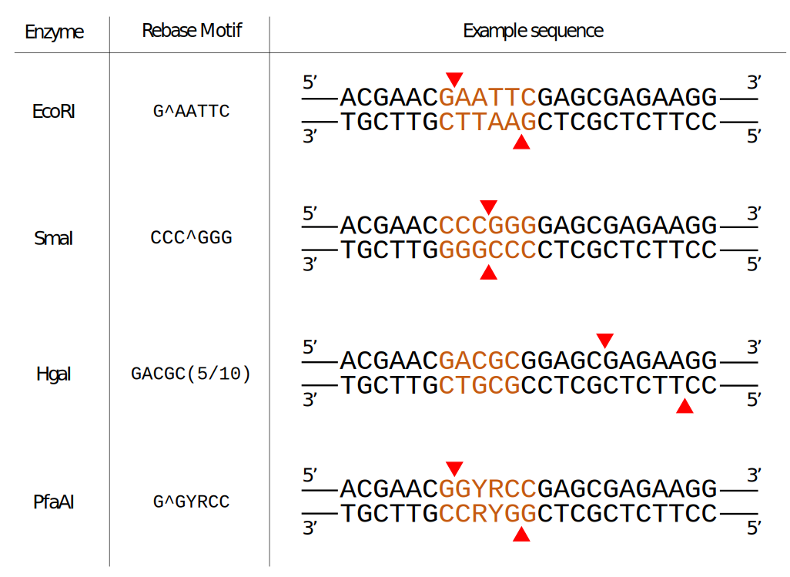
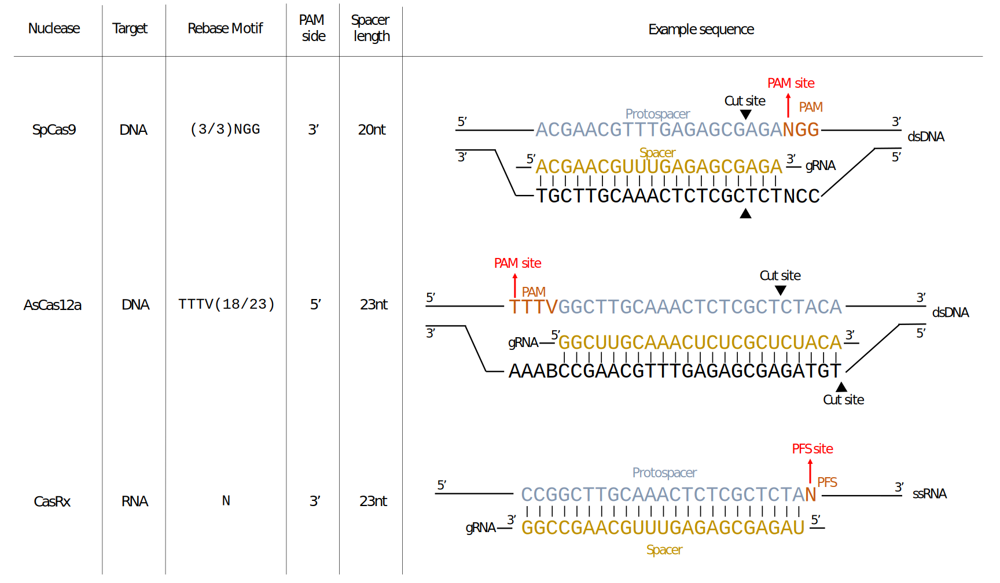
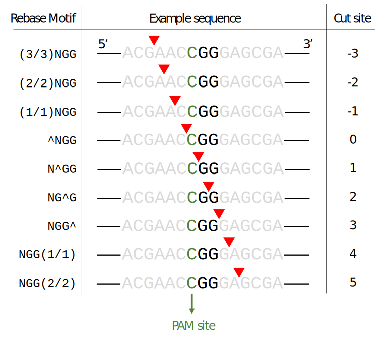
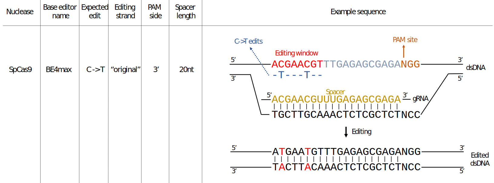
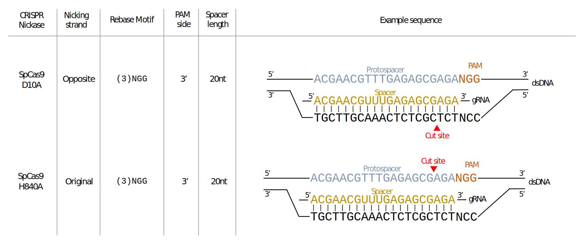

```{r, echo=FALSE, results="hide"}
options("knitr.graphics.auto_pdf"=TRUE, eval=TRUE)
```


# Overview

`crisprBase` provides S4 classes to represent nucleases, and more 
specifically CRISPR nucleases. It also provides arithmetic 
functions to extract genomic ranges to help with the design and manipulation 
of CRISPR guide-RNAs (gRNAs). The classes and functions are designed to work 
with a broad spectrum of nucleases and applications, including 
PAM-free CRISPR nucleases, RNA-targeting nucleases, and the more
general class of restriction enzymes. It also includes functionalities for
CRISPR nickases. 

It provides a language and convention for our gRNA design ecosystem 
described in our recent bioRxiv preprint:
["A comprehensive Bioconductor ecosystem for the design of CRISPR guide RNAs across nucleases and technologies"](https://www.biorxiv.org/content/10.1101/2022.04.21.488824v2)


# Installation

## Software requirements

### OS Requirements

This package is supported for macOS, Linux and Windows machines.
It was developed and tested on R version 4.2.

## Installation

`crisprBase` can be installed by typing the
following commands inside of an R session:

```r
install.packages("devtools")
library(devtools)
install_github("Jfortin1/crisprBase")
```


### Getting started

We load `crisprBase` in the usual way:

```{r, warnings=FALSE, message=FALSE}
library(crisprBase)
```


# Nuclease class

The `Nuclease` class is designed to store minimal information about the
recognition sites of general nucleases, such as restriction enzymes. 
The `Nuclease` class has 5 fields: `nucleaseName`, `targetType`,
`metadata`, `motifs` and `weights`. 
The `nucleaseName` field is a string specifying a name
for the nuclease.
The `targetType` specifies if the nuclease targets "DNA" (deoxyribonucleases)
or "RNA" (ribonucleases). The `metadata` field is a `list` of arbitrary length
to store additional information about the nuclease.

The `motifs` field is a character vector that specify one of several DNA
sequence motifs that are recognized by the nuclease for cleavage (always in 
the 5' to 3' direction). The optional `weights` field is a numeric vector
specifying relative cleavage probabilities corresponding to the motifs 
specified by `motifs`. Note that we use DNA to represent motifs irrespectively
of the target type for simplicity. 

We use the Rebase convention to represent motif sequences [@rebase]. 
For enzymes that cleave within the recognition site, 
we add the symbol `^` within the recognition sequence to specify 
the cleavage site, always in the 5' to 3' direction. For enzymes that 
cleave away from the recognition site, we specify the distance of the cleavage
site using a `(x/y)` notation where `x`
represents the number of nucleotides away from the recognition sequence on the
original strand, and `y` represents the number of nucleotides away from the
recognition sequence on the reverse strand. 

## Examples 

The EcoRI enzyme recognizes the palindromic motif `GAATTC`, and cuts after
the first nucleotide, which is specified using the `^` below:


```{r, warning=FALSE, message=FALSE}
library(crisprBase)

EcoRI <- Nuclease("EcoRI",
                  targetType="DNA",
                  motifs=c("G^AATTC"),
                  metadata=list(description="EcoRI restriction enzyme"))
```

The HgaI enzyme recognizes the motif `GACGC`, and cleaves DNA at 5
nucleotides downstream of the recognition sequence on the original strand, 
and at 10 nucleotides downstream of the recognition sequence on the reverse
strand:

```{r}
HgaI <- Nuclease("HgaI",
                 targetType="DNA",
                 motifs=c("GACGC(5/10)"),
                 metadata=list(description="HgaI restriction enzyme"))
```

In case the cleavage site was upstream of the recognition sequence, we would
instead specify `(5/10)GACGC`. 

Note that any nucleotide letter that is part of the extended IUPAC nucleic acid
code can be used to represent recognition motifs. For instance, we use `Y`
and `R` (pyrimidine and purine, respectively) to specify the possible
recognition sequences for PfaAI:

```{r}
PfaAI <- Nuclease("PfaAI",
                  targetType="DNA",
                  motifs=c("G^GYRCC"),
                  metadata=list(description="PfaAI restriction enzyme"))
```

## Accessor functions

The accessor function `motifs` retrieve the motif
sequences:


```{r}
motifs(PfaAI)
```

To expand the motif sequence into all combinations of valid sequences with only
A/C/T/G nucleotides, users can use `expand=TRUE`. 

```{r}
motifs(PfaAI, expand=TRUE)
```


```{r, echo=FALSE, fig.cap="Examples of restriction enzymes"}

```


# CrisprNuclease class

CRISPR nucleases are examples of RNA-guided nucleases. For cleavage, it
requires two binding components. For CRISPR nucleases targeting DNA,
the nuclease needs to first recognize a
constant nucleotide motif in the target DNA called the protospacer adjacent 
motif (PAM) sequence. Second, the guide-RNA (gRNA), which guides the nuclease
to the target sequence, needs to bind to a complementary sequence adjacent
to the PAM sequence (protospacer sequence). The latter can be thought of a variable binding motif 
that can be specified by designing corresponding gRNA sequences. For CRISPR
nucleases targeting RNA, the equivalent of the PAM sequence is 
called the Protospacer Flanking Sequence (PFS). We use the terms PAM and PFS
interchangeably as it should be clear from context. 

The `CrisprNuclease` class allows to characterize both binding components by
extending the `Nuclease` class to contain information about the gRNA
sequences.The PAM sequence characteristics, and the cleavage distance with
respect to the PAM sequence, are specified using the motif nomenclature
described in the Nuclease section above. 

3 additional fields are required: `pam_side`, `spacer_length` and
`spacer_gap`. The `pam_side` field can only take 2 values, `5prime` and
`3prime`, and specifies on which side the PAM sequence is located with 
respect to the protospacer sequence. While it would be more appropriate to use
the terminology `pfs_side` for RNA-targeting nucleases, we still use the term
`pam_side` for simplicity.


The `spacer_length` specifies
a default spacer length, and the `spacer_gap` specifies a distance
(in nucleotides) between the PAM (or PFS) sequence and spacer sequence.
For most nucleases,`spacer_gap=0` as the spacer sequence is located directly
next to the PAM/PFS sequence. 

We show how we construct a `CrisprNuclease` object for the commonly-used Cas9
nuclease (Streptococcus pyogenes Cas9):

```{r}
SpCas9 <- CrisprNuclease("SpCas9",
                         targetType="DNA",
                         pams=c("(3/3)NGG", "(3/3)NAG", "(3/3)NGA"),
                         weights=c(1, 0.2593, 0.0694),
                         metadata=list(description="Wildtype Streptococcus 
                                       pyogenes Cas9 (SpCas9) nuclease"),
                         pam_side="3prime",
                         spacer_length=20)
SpCas9
```

Similar to the `Nuclease` class, we can specify PAM sequences using the 
extended nucleotide code. SaCas9 serves as a good example:

```{r}
SaCas9 <- CrisprNuclease("SaCas9",
                         targetType="DNA",
                         pams=c("(3/3)NNGRRT"),
                         metadata=list(description="Wildtype Staphylococcus 
                         aureus Cas9 (SaCas9) nuclease"),
                         pam_side="3prime",
                         spacer_length=21)
SaCas9
```


Here is another example where we construct a `CrisprNuclease` object for the
commonly-used Cas12a nuclease (AsCas12a):

```{r}
AsCas12a <- CrisprNuclease("AsCas12a",
                           targetType="DNA",
                           pams="TTTV(18/23)",
                           metadata=list(description="Wildtype Acidaminococcus
                           Cas12a (AsCas12a) nuclease."),
                           pam_side="5prime",
                           spacer_length=23)
AsCas12a
```

## CrisprNuclease objects provided in CrisprBase

Several already-constructed `crisprNuclease` objects are available 
in `crisprBase`, 
see `data(package="crisprBase")`.


# CRISPR arithmetics

## CRISPR terminology


The terms **spacer** and **protospacer** are not interchangeable. **spacer**
refers to the sequence used in the gRNA construct to guide the Cas nuclease to
the target **protospacer** sequence in the host genome / transcriptome.
The **protospacer** sequence is adjacent to the PAM sequence /  PFS sequence.
We use the terminology **target** sequence to refer to the protospacer and PAM sequence taken together. For DNA-targeting nucleases such as Cas9 and Cas12a, the spacer and protospacer sequences are identical from a nucleotide point of view. For RNA-targeting nucleases such as Cas13d, the spacer and protospacer sequences are the reverse complement of each other. 

An gRNA spacer sequence does not always uniquely target the host genome 
(a given sgRNA spacer can map to multiple protospacers in the genome). 
However, for a given reference genome, protospacer sequences can be uniquely
identified using a combination of 3 attributes: 

- **chr**: chromosome name 
- **strand**: forward (+) or reverse (-)
- **pam_site**: genomic coordinate of the first nucleotide of the
nuclease-specific PAM sequence. For SpCas9, this corresponds to the genomic
coordinate of N in the NGG PAM sequence. For AsCas12a, this corresponds to the
genomic coordinate of the first T nucleotide in the TTTV PAM sequence. 
For RNA-targeting nucleases, this corresponds to the first nucleotide of 
the PFS (we do not use `pfs_site` for simplicity).


```{r, echo=FALSE, fig.cap="Examples of CRISPR nucleases"}

```

## Cut site

For convention, we used the nucleotide directly downstream of the DNA cut to
represent the cut site nucleotide position. For instance, for SpCas9 
(blunt-ended dsDNA break), the cut site occurs at position -3 with respect to
the PAM site. For AsCas12a, the 5nt overhang dsDNA break occurs at 18 
nucleotides after the PAM sequence on the targeted strand. Therefore the cute
site on the forward strand occurs at position 22 with respect to the PAM site,
and at position 27 on the reverse strand.

The convenience function `cutSites` extracts the cut site coordinates
relative to the PAM site:

```{r}
data(SpCas9, package="crisprBase")
data(AsCas12a, package="crisprBase")
cutSites(SpCas9)
cutSites(SpCas9, strand="-")
cutSites(AsCas12a)
cutSites(AsCas12a, strand="-")
```

Below is an illustration of how different motif sequences and cut patterns
translate into cut site coordinates with respect to a PAM sequence NGG:

```{r, echo=FALSE, fig.cap="Examples of cut site coordinates"}

```


## Obtaining spacer and PAM sequences from target sequences

Given a list of target sequences (protospacer + PAM) and a `CrisprNuclease` object, one can extract protospacer and PAM sequences using the functions
`extractProtospacerFromTarget` and `extractPamFromTarget`, respectively.

```{r}
targets <- c("AGGTGCTGATTGTAGTGCTGCGG",
             "AGGTGCTGATTGTAGTGCTGAGG")
extractPamFromTarget(targets, SpCas9)
extractProtospacerFromTarget(targets, SpCas9)
```


## Obtaining genomic coordinates of protospacer sequences using PAM site coordinates


Given a PAM coordinate, there are several functions in `crisprBase` that 
allows to get get coordinates of the full PAM sequence, protospacer sequence, and target sequence: `getPamRanges`, `getTargetRanges`, and
`getProtospacerRanges`, respectively. The output objects are `GRanges`:

```{r}
chr      <- rep("chr7",2)
pam_site <- rep(200,2)
strand   <- c("+", "-")
gr_pam <- getPamRanges(seqnames=chr,
                       pam_site=pam_site,
                       strand=strand,
                       nuclease=SpCas9)
gr_protospacer <- getProtospacerRanges(seqnames=chr,
                                       pam_site=pam_site,
                                       strand=strand,
                                       nuclease=SpCas9)
gr_target <- getTargetRanges(seqnames=chr,
                             pam_site=pam_site,
                             strand=strand,
                             nuclease=SpCas9)
gr_pam
gr_protospacer
gr_target
```

and for AsCas12a:


```{r}
gr_pam <- getPamRanges(seqnames=chr,
                       pam_site=pam_site,
                       strand=strand,
                       nuclease=AsCas12a)
gr_protospacer <- getProtospacerRanges(seqnames=chr,
                                       pam_site=pam_site,
                                       strand=strand,
                                       nuclease=AsCas12a)
gr_target <- getTargetRanges(seqnames=chr,
                             pam_site=pam_site,
                             strand=strand,
                             nuclease=AsCas12a)
gr_pam
gr_protospacer
gr_target
```

# BaseEditor class

Base editors are inactive Cas nucleases coupled with a specific deaminase.
For instance, the first cytosine base editor (CBE) was obtained by coupling
a cytidine deaminase with dCas9 to convert Cs to Ts [@komor].


```{r, echo=FALSE, fig.cap="Examples of base editors."}

```


We provide in `crisprBase` a S4 class, `BaseEditor`, to represent base editors.
It extends the `CrisprNuclase` class with 3 additional fields:

- `baseEditorName`: string specifying the name of the base editor.
- `editingStrand`: strand where the editing happens with respect to the target
protospacer sequence ("original" or "opposite").
- `editingWeights`: a matrix of experimentally-derived editing weights. 

We now show how to build a `BaseEditor` object with the CBE base editor BE4max
with weights obtained from @behive.


We first obtain a matrix of weights for the BE4max editor stored in 
the package `crisprBase`:

```{r}
# Creating weight matrix
weightsFile <- system.file("be/b4max.csv",
                           package="crisprBase",
                           mustWork=TRUE)
ws <- t(read.csv(weightsFile))
ws <- as.data.frame(ws)
```

The row names of the matrix must correspond to the nucleotide substitutions
Nucleotide substitutions that are not present in the matrix will have weight
assigned to 0.

```{r}
rownames(ws)
```

The column names must correspond to the relative position with respect
to the PAM site. 

```{r}
colnames(ws) <- ws["Position",]
ws <- ws[-c(match("Position", rownames(ws))),,drop=FALSE]
ws <- as.matrix(ws)
head(ws)
```

Since BE4max uses Cas9, we can use the SpCas9 `CrisprNuclease` object
available in `crisprBase` to build the `BaseEditor` object:

```{r}
data(SpCas9, package="crisprBase")
BE4max <- BaseEditor(SpCas9,
                     baseEditorName="BE4max",
                     editingStrand="original",
                     editingWeights=ws)
metadata(BE4max)$description_base_editor <- "BE4max cytosine base editor."
BE4max
```


One can quickly visualize the editing weights using the function 
`plotEditingWeights`:

```{r}
plotEditingWeights(BE4max)
```


# CrisprNickase class

CRISPR nickases can be created by mutating one of the two nuclease domains
of a CRISPR nuclease. They create single-strand breaks instead of double-strand
breaks.

For instance, the D10A mutation of SpCas9 inactivates the RuvC domain,
and the resulting CRISPR nickase (Cas9D10A) cleaves only the strand opposite
to the protospacer sequence. The H840A mutation of SpCas9 inactivates the 
HNN domain, and the resulting CRISPR nickase (Cas9H840A) cleaves only 
the strand that contains the protospacer sequence. See Figure below.

```{r, echo=FALSE, fig.cap="Examples of CRISPR nickases."}

```

The `CrisprNickase` class in `crisprBase` works similar to the `CrisprNuclease`
class:

```{r}
Cas9D10A <- CrisprNickase("Cas9D10A",
                           nickingStrand="opposite",
                           pams=c("(3)NGG", "(3)NAG", "(3)NGA"),
                           weights=c(1, 0.2593, 0.0694),
                           metadata=list(description="D10A-mutated Streptococcus
                                         pyogenes Cas9 (SpCas9) nickase"),
                           pam_side="3prime",
                           spacer_length=20)
 
Cas9H840A <- CrisprNickase("Cas9H840A",
                            nickingStrand="original",
                            pams=c("(3)NGG", "(3)NAG", "(3)NGA"),
                            weights=c(1, 0.2593, 0.0694),
                            metadata=list(description="H840A-mutated Streptococcus
                                          pyogenes Cas9 (SpCas9) nickase"),
                            pam_side="3prime",
                            spacer_length=20)
```

The `nickingStrand` field indicates which strand is being cleaved by the
nickase.

# RNA-targeting nucleases

RNA-targeting CRISPR nucleases, such as the Cas13 family of nucleases,
target single-stranded RNA (ssRNA) instead of dsDNA as the name suggests. 
The equivalent of the PAM sequence is called
Protospacer Flanking Sequence (PFS). 

For RNA-targeting CRISPR nucleases, the spacer sequence is 
the reverse complement of the protospacer sequence. This differs from 
DNA-targeting CRISPR nucleases, for which the spacer and 
protospacer sequences are identical.

We can construct an RNA-targeting nuclease in way similar to a 
DNA-targeting nuclease by specifying `target="RNA"`. As an example,
we construct below a CrisprNuclease object for the CasRx nuclease (Cas13d 
from Ruminococcus flavefaciens strain XPD3002):


```{r}
CasRx <- CrisprNuclease("CasRx",
                        targetType="RNA",
                        pams="N",
                        metadata=list(description="CasRx nuclease"),
                        pam_side="3prime",
                        spacer_length=23)
CasRx
```

# Additional notes

## dCas9 and other "dead" nucleases

The CRISPR inhibition (CRISPRi) and CRISPR activation (CRISPRa) technologies
uses modified versions of CRISPR nucleases that lack endonuclease activity,
often referred to as "dead Cas" nucleases, such as the dCas9. 

While fully-active Cas nucleases and dCas nucleases differ in terms of
applications and type of genomic perturbations, the gRNA design remains
unchanged in terms of spacer sequence search and genomic coordinates. Therefore
it is convenient to use the fully-active version of the nuclease throughout
`crisprBase`. 


# License

The project as a whole is covered by the MIT license. 

# Reproducibility

```{r}
sessionInfo()
```

# References


