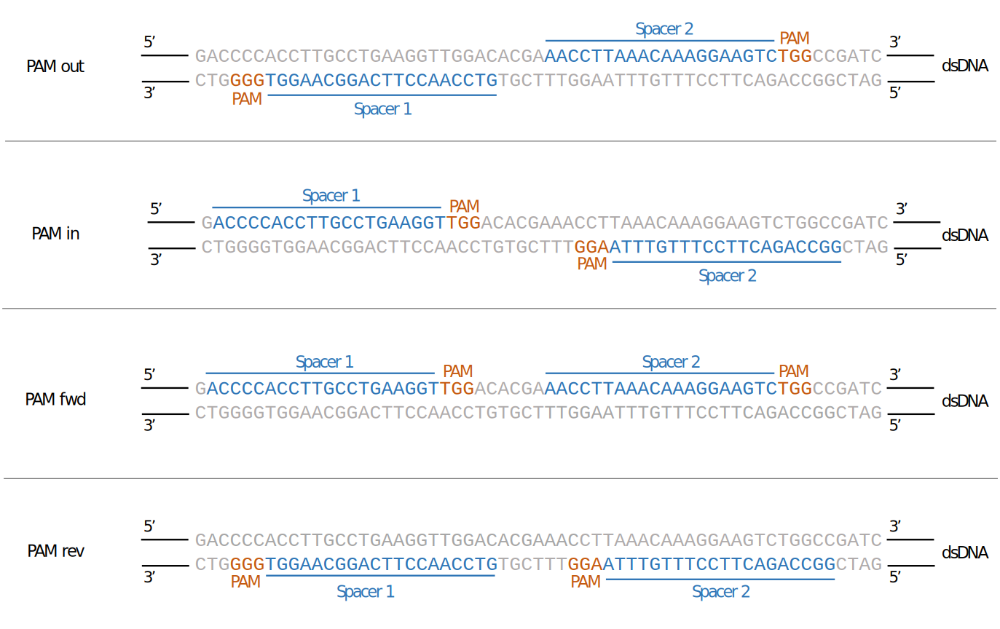

```{r, echo=FALSE, results="hide"}
options("knitr.graphics.auto_pdf"=TRUE)
```

Authors: Jean-Philippe Fortin, Luke Hoberecht

Date: `r format(Sys.time(), '%d %B, %Y')`


# Introduction

In this tutorial, we illustrate the main functionalities of  `crisprDesign` 
for designing pairs of gRNAs. 

# Getting started

## Installation 

First, we install the necessary packages for this tutorial from Bioconductor
using the following commands:

```{r, eval=FALSE}
if (!requireNamespace("BiocManager", quietly = TRUE))
    install.packages("BiocManager")

BiocManager::install("crisprBase")
BiocManager::install("crisprDesign")
BiocManager::install("BSgenome.Hsapiens.UCSC.hg38")
```

as well as the data package `crisprDesignData` from GitHub:

```{r, eval=FALSE, warning=FALSE, message=FALSE, results='hide'}
install.packages("devtools")
devtools::install_github("Jfortin1/crisprDesignData")
```

## Terminology

See the [CRISPRko design vignette](https://github.com/crisprVerse/Tutorials/tree/master/Design_CRISPRko_Cas9) to get familiar with the terminology used throughout
this tutorial.

## Paired gRNA design overview

There is a number of applications that require the design of pairs of gRNAs.
Here is a list of cases that will be covered in this tutorial:

1. Double nicking with CRISPR/Cas9 [@ran2013double]
2. Dual-promoter screening systems [@han2017synergistic]
3. Multiplexing gRNAs with arrayed spacers (enAsCas12a) [@deweirdt2021optimization]
4. Nanopore Cas9-targeted sequencing (nCATS) [@gilpatrick2020targeted]

Before we dive into the different applications, we will describe a general
use case to go over the main paired gRNA design features.

# Designing pairs of gRNAs flanking a genomic region

To illustrate the general concept behind paired gRNA design, we 
will show here how to design pairs of gRNAs flanking the second exon
of the canonical transcript (ENST00000311936) of the human 
gene KRAS (ENSG00000133703).

We first start by loading the necessary packages:

```{r, message=FALSE, warning=FALSE, results='hide' }
library(crisprDesign)
library(crisprDesignData)
library(crisprBase)
library(BSgenome.Hsapiens.UCSC.hg38)

```

We will be designing gRNAs for the SpCas9 nuclease. We load the `SpCas9` 
nuclease object from the `crisprBase` package (see the `crisprBase` [vignette](https://github.com/crisprVerse/crisprBase) for 
instructions on how to create or load alternative nucleases):


```{r}
data(SpCas9, package="crisprBase")
```

Let's get the genomic coordinates of the second exon.
Let's first obtain from `crisprDesignData` a `GRangesList` object that defines
the genomic coordinates (in hg38 coordinates) of coding genes in 
the human genome:

```{r}
data(txdb_human, package="crisprDesignData")
```

We can get the exon coodinates using the function `queryTxObject`:


```{r}
exons <- queryTxObject(txObject=txdb_human,
                       featureType="exons",
                       queryColumn="tx_id",
                       queryValue="ENST00000311936")
exons
```

and we select the second exon:

```{r}
exon <- exons[exons$exon_rank==2]
names(exon) <- "exon_kras"
exon
```

The exon is on chr12, and spans the region 25245274-25245395 (122 
nucleotides in length). We aim to design gRNAs pairs for which one 
gRNA is located upstream of the exon, and another located downstream 
of the exon. Let's define those regions to be 500 nucleotides on each side:


```{r}
library(IRanges)
regionUpstream   <- IRanges::flank(exon, width=100, start=FALSE)
regionDownstream <- IRanges::flank(exon, width=100, start=TRUE)
names(regionUpstream) <- "upstreamTarget"
names(regionDownstream) <- "downstreamTarget"
```

We specify the BSgenome for hg38 coordinates

```{r}
bsgenome <- BSgenome.Hsapiens.UCSC.hg38
```

and we are now ready to find all spacer pairs:

```{r}
pairs <- findSpacerPairs(x1=regionUpstream,
                         x2=regionDownstream,
                         bsgenome=bsgenome,
                         crisprNuclease=SpCas9)
```

The `x1` and `x2` arguments specify the genomic regions in which gRNAs at position 1 and position 2 should be targeting, respectively. Let's see what the results look like:

```{r}
head(pairs, n=3)
```

The returned object is a `PairedGuideSet`, which can be though of a list of two `GuideSet` objects. The first and second `GuideSet` store information about gRNAs at position 1 and position 2, respectively. They can be accessed using the `first` and `second` functions:

```{r}
grnas1 <- first(pairs)
head(grnas1, n=3)
```

and 

```{r}
grnas2 <- second(pairs)
head(grnas2, n=3)
```

The `pamOrientation` function returns the PAM orientation of the pairs:

```{r}
head(pamOrientation(pairs))
```

and takes 4 different values: `in` (for PAM-in configuration), `out` (for PAM-out configuration), `fwd` (both gRNAs target the forward strand), and `rev` (both gRNAs target the reverse strand); see figure below for an illustration of the PAM orientations for the SpCas9 nuclease. The importance of the PAM orientation is application-specific, and will be discussed in the relevant sections below.

```{r, echo=FALSE, out.width = "75%", fig.align="center", fig.cap="Different PAM orientations for Cas9 paired gRNAs"}

```


The function `pamDistance` returns the distance between the PAM sites of the two gRNAs. The function `cutDistance` returns the distance between the cut sites of the two gRNAs, and the function `spacerDistance` returns the distance between the two spacer sequences of the gRNAs.


# Session Info

```{r}
sessionInfo()
```

# References


